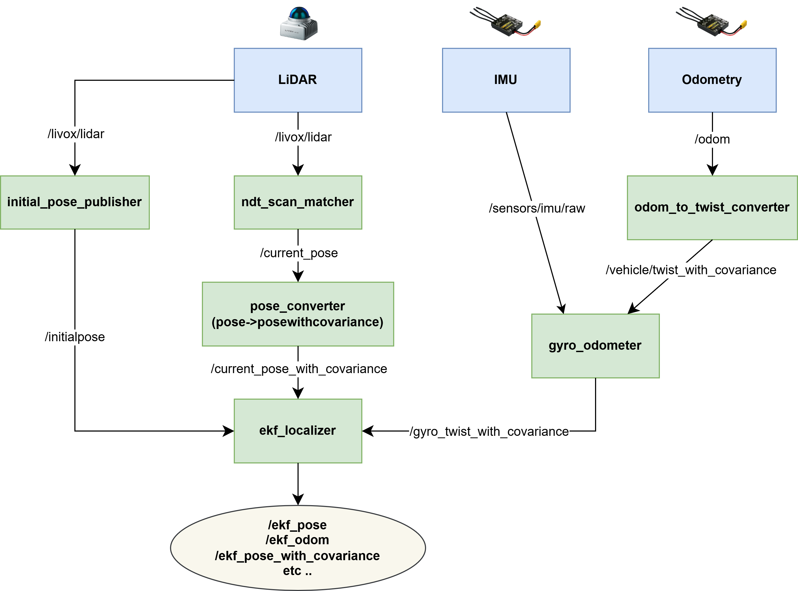

# state estimation for f1tenth racing stack(misys lab)


# Demo

mapping demo(15x speed)


localization demo(ndt scan matcher + ekf localizer, 3x speed)


<br>
real world car drive demo(1.5x speed)

# Node Graph
<p align="center">
  
</p>

# Target HW
- NVIDIA AGX Orin
- Livox MID 360 (3D LiDAR)
- VESC mkIV


# Environment
- Ubuntu 22.04
- ROS2 humble


# Build
This repository is meant to be used as the `src` of a ROS 2 (Humble) workspace.

```bash
mkdir -p ~/ros2_ws/src
cd ~/ros2_ws/src
git clone https://github.com/jeonseoknam/3d_lidar_state_estimation.git .

# Livox driver needs Livox-SDK2 (bundled under deps/Livox-SDK2)
cd ~/ros2_ws/src/deps/Livox-SDK2 && mkdir -p build && cd build && cmake .. && make -j && sudo make install

cd ~/ros2_ws
rosdep install --from-paths src --ignore-src -r -y   # optional, resolves dependencies
colcon build --symlink-install
source install/setup.bash
```

> Remember to `source ~/ros2_ws/install/setup.bash` in every new terminal below.

# Usage
All pipelines start by bringing up the LiDAR driver, which publishes `/livox/lidar`
(point cloud) and `/sensors/imu/raw, /odom` from VESC(optional):

## 1. Mapping
Build a point-cloud map with the scan matcher and graph-based loop closure.

```bash
# terminal 1 — sensor
ros2 launch livox_ros_driver2 msg_MID360_launch.py

# terminal 2 — SLAM (scan matcher + graph-based loop closure + RViz)
ros2 launch lidarslam slam.launch.py

# terminal 3 — save the map once you have driven the whole area
ros2 service call /map_save std_srvs/srv/Empty
```

This writes `map.pcd` and `pose_graph.g2o` (the map is also auto-saved on loop
closure). Tune mapping parameters in
`lidarslam_ros2/lidarslam/param/lidarslam.yaml`.

> For a minimal mapping node without loop closure / RViz, use
> `ros2 launch scanmatcher mapping_robot.launch.py` instead.

## 2. Localization (NDT only)
Pure NDT scan matching against a pre-built map.

Before launching, edit `lidarslam_ros2/lidarslam/param/lidarslam.yaml`:
- set `map_path` to your saved `map.pcd`
- set the initial pose (`initital_pose_x/y/z`, `initital_pose_q*`)

```bash
# terminal 1 — sensor
ros2 launch livox_ros_driver2 msg_MID360_launch.py

# terminal 2 — NDT scan-matching localization + RViz
ros2 launch lidarslam localization.launch.py
```

The NDT scan matcher estimates the pose and publishes the `map -> base_link` TF.

## 3. Localization (NDT + ekf_localizer)
Fuses the NDT pose with gyro/odometry through an EKF for a smoother, higher-rate
state estimate. Map setup is the same as in section 2.

```bash
# terminal 1 — sensor
ros2 launch livox_ros_driver2 msg_MID360_launch.py

# terminal 2 — full localization stack
ros2 launch ekf_localizer full_localization.launch.xml
```

`full_localization.launch.xml` brings up the whole pipeline:
`odom_to_twist_converter`, `gyro_odometer`, `ekf_localizer`
(with `pose_to_pose_with_cov` + `initial_pose_publisher`), the `lidarslam`
NDT localization, and `carstate_3d`.

Expected inputs:
- vehicle twist on `/vehicle/twist_with_covariance`
- IMU on `/sensors/imu/raw`

The EKF fuses `/ndt_pose_with_covariance` (pose) with
`/gyro_twist_with_covariance` (twist) and outputs the fused state on
`/ekf_pose` and `/ekf_odom`.

# Referenced open source
- https://github.com/rsasaki0109/lidarslam_ros2
- https://github.com/TUM-AVS/RoboRacer-3DLiDAR
- https://github.com/Livox-SDK/Livox-SDK2
- https://github.com/Livox-SDK/livox_ros_driver2
- https://autowarefoundation.github.io/autoware.universe_planning/pr-5583/localization/gyro_odometer/
- https://autowarefoundation.github.io/autoware.universe_planning/pr-5583/localization/ekf_localizer/
